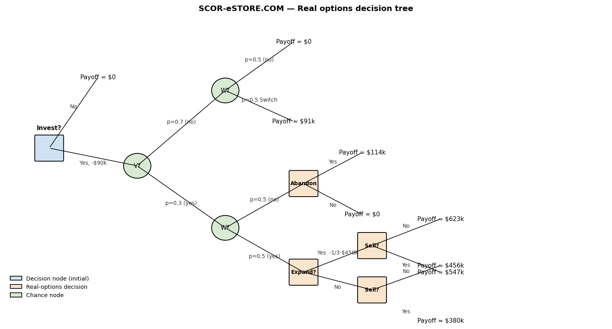
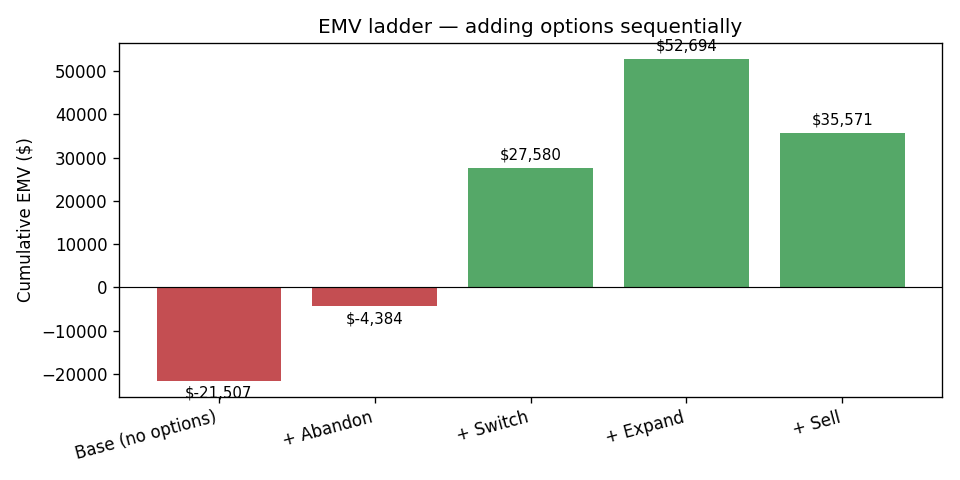
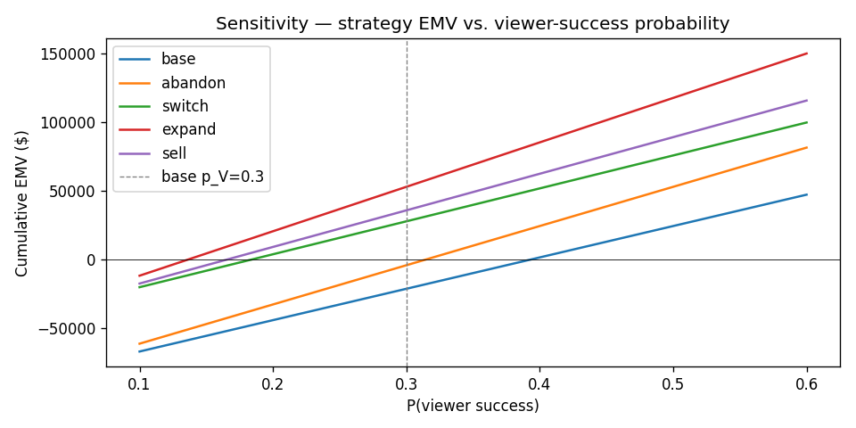

# Tech Startup Real Options Valuation

**[Live demo](https://mason-startup-real-options.streamlit.app/)** — runs in your browser, no install required.

Multi-stage investment valuation for a software startup under uncertainty. Uses
**decision-tree analysis** and **real options** to value four managerial
flexibility options on top of a base investment, identifies the composite
strategy with the highest EMV, and stress-tests the recommendation under risk
aversion and parameter sensitivity.



## The investment

Bernard holds a **1/3 stake** in a venture building a browser-based 3D viewer
and an e-commerce website. Initial capital is **$90K**. Full success at
month 18 pays **$500K** per 1/3 share. Products succeed independently:
`P(viewer) = 0.30`, `P(website) = 0.50`.

## Options modelled

| Option | Month | Trigger | Action |
|---|---|---|---|
| **Abandon** | 4 | Viewer non-functional | Shrink-wrap & sell viewer rights |
| **Switch** | 6 | Low traffic / conversion | License alternative viewer, exit web business |
| **Expand** | 6 | EBITDA ≥ $18K/mo | Invest to double NPV |
| **Sell** | 18 | Control premium ≥ $250K | Buy co-owners out |

## Key result

| Strategy | Cumulative EMV |
|---|---:|
| Base Case (no options) | $ -21,600 |
| + Abandon | $ -4,500 |
| + Switch | $ 27,500 |
| **+ Expand (optimal)** | **$ 52,550** |
| + Sell | $ 35,450 |



**Optimal strategy: `Abandon & Switch & Expand`, EMV ≈ $52,550.**

The **Sell** option *destroys* value if exercised unconditionally — the
discounted buyout cost exceeds the control-premium benefit. It should only
fire when the projected premium clears $250K.

## Risk aversion

Under exponential utility `u(x) = 1 − exp(−x / 100,000)`, the Abandon option
lifts the certainty equivalent from **−$74K to −$57K** — a $17K risk-adjusted
gain for a nearly identical EMV. That's the textbook demonstration that
managerial flexibility has value even when its expected-value contribution
looks marginal.

## Sensitivity



The `Abandon & Switch & Expand` strategy dominates across the full 10 % to
60 % range of viewer-success probability — the recommendation is robust to
moderate estimation error on that parameter.

## Repository layout

```
.
├── real_options_valuation.ipynb   ← main analysis notebook (narrative + viz)
├── real_options_app.py            ← Streamlit dashboard
├── real_options.py                ← valuation library (dataclass + functions)
├── build_decision_tree.py         ← standalone tree-diagram renderer
├── case_parameters.json           ← case inputs (probabilities, cash flows)
├── case_brief.pdf                 ← original case study
├── decision_tree.png              ← rendered decision tree
├── emv_ladder.png                 ← EMV comparison across strategies
├── sensitivity_p_viewer.png       ← parameter sensitivity
└── requirements.txt
```

## Run it

### Notebook walkthrough

```bash
pip install -r requirements.txt
python build_decision_tree.py       # (re)render decision tree
jupyter notebook real_options_valuation.ipynb
```

### Interactive dashboard

```bash
streamlit run real_options_app.py
```

The dashboard:

- **Live editing of every case parameter** — probabilities, payoffs,
  discount rate, ownership share, risk tolerance — with the EMV ladder,
  optimal strategy, and certainty equivalents updating in real time.
- **EMV ladder tab** — bar chart of cumulative EMV after each option is
  layered, plus the joint outcome probabilities derived from your inputs.
- **Risk aversion tab** — utility curve plotted with the certainty
  equivalents of the base opportunity and the abandon option marked.
- **Sensitivity sweep tab** — pick any input parameter, sweep it across a
  plausible range, see how every composite strategy's EMV responds.
- **Tornado tab** — perturb each input ±20 % independently and visualise
  which assumptions the recommendation is most leveraged on.

#```python
from real_options import Case, value_strategies, optimal_strategy
case = Case.from_json("case_parameters.json")
print(value_strategies(case))
print(optimal_strategy(case))
```
